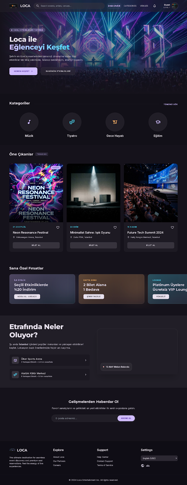
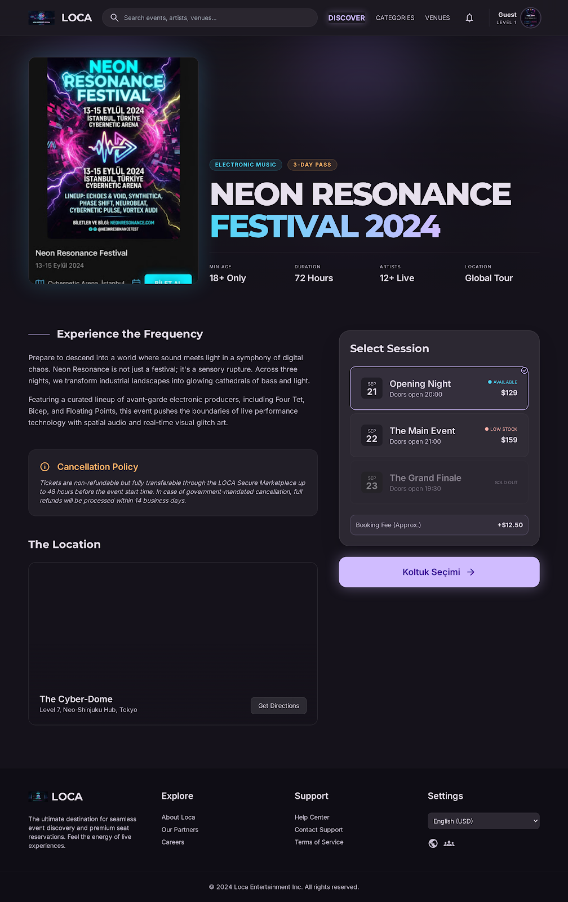
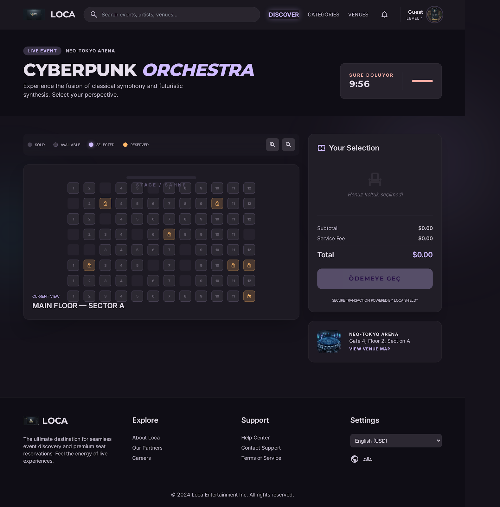
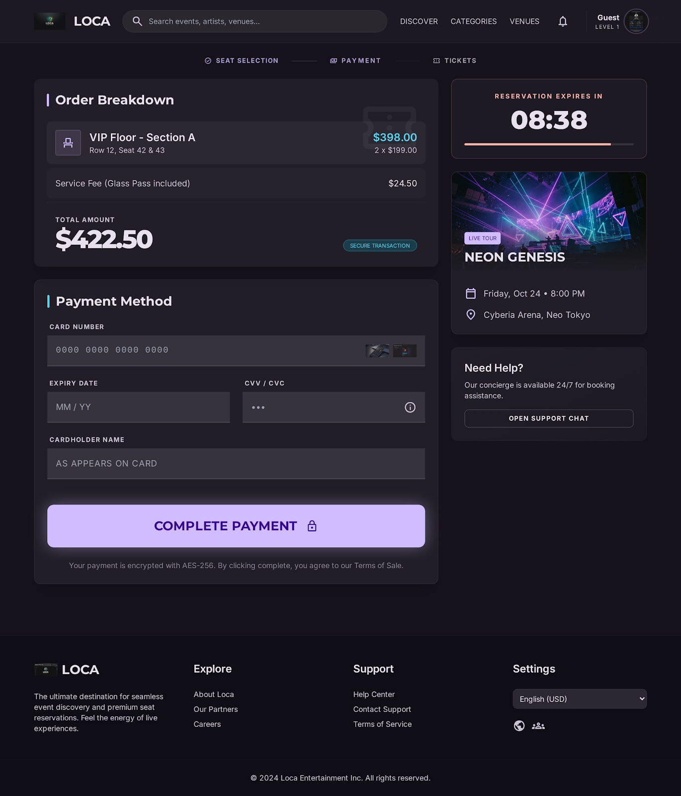
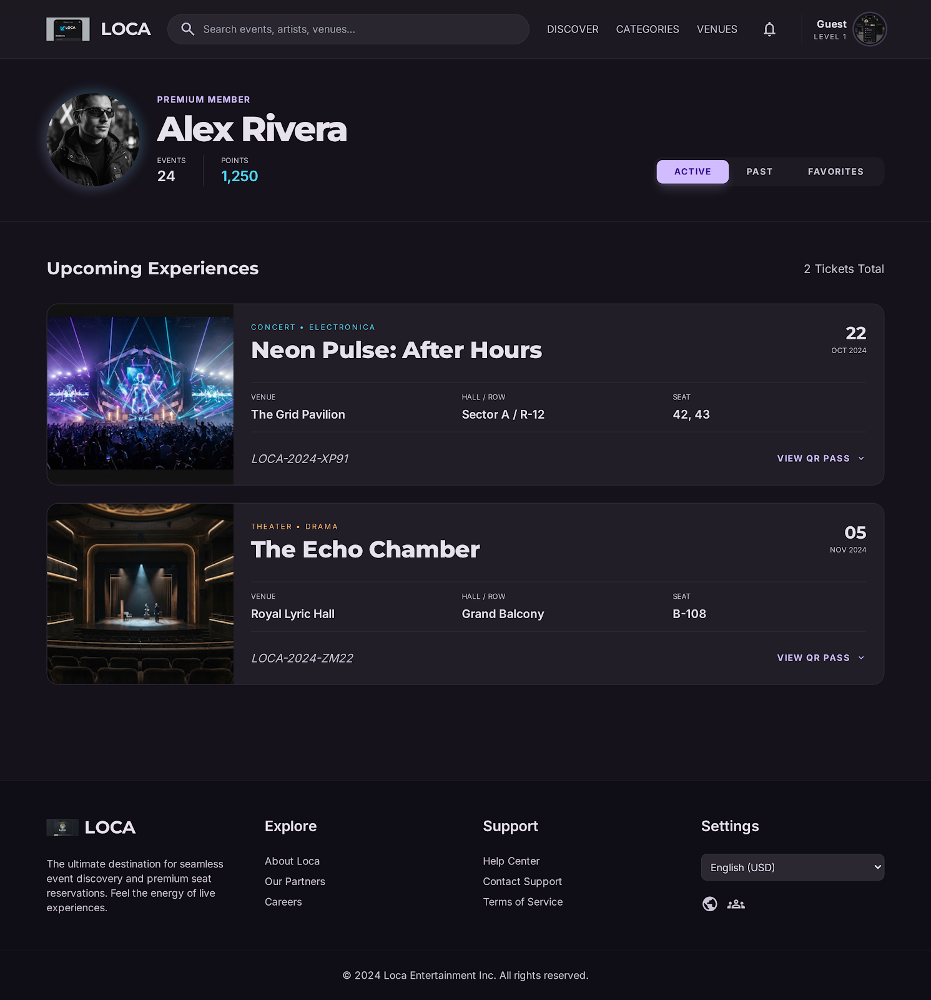
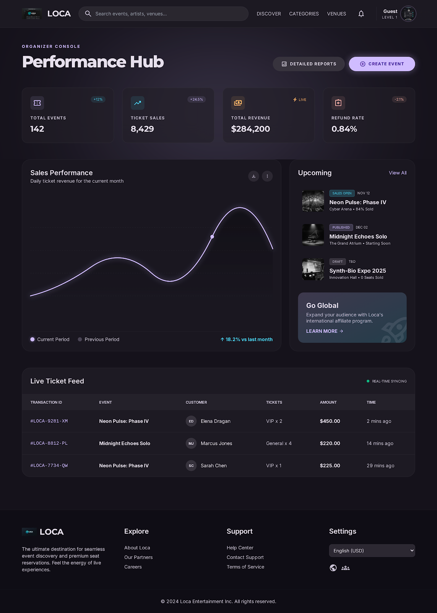
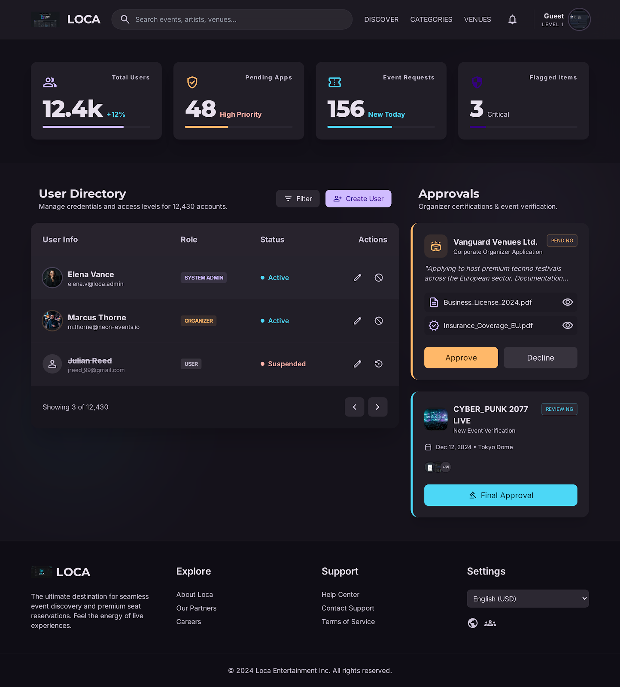
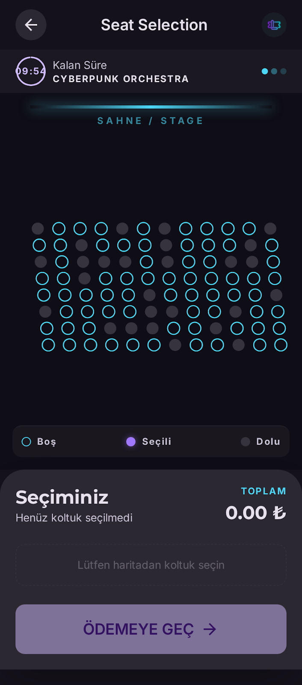

# Tasarım

> Tarih: 24.07.2026 · Gün 1

**Figma:** https://www.figma.com/design/6UIsC0O7T9SUAoZf5dKk2R/LOCA

## 1. Tasarım yönü

Koyu zemin üzerine neon vurgular; "glassmorphism" yüzeyler. Etkinlik biletlemesi duygusal bir alım kararı — arayüzün konser öncesi heyecanı taşıması isteniyor. Aynı zamanda koltuk seçimi ekranı yoğun bilgi barındırdığı için okunabilirlik yüksek tutuldu.

Tipografi ikilisi: başlıklarda **Montserrat** (geometrik, iddialı), gövde ve arayüzde **Inter** (yüksek okunabilirlik, tabular rakam desteği). Tabular rakam geri sayım sayacı ve para alanlarında rakamların zıplamaması için gerekli.

Ritim 8 piksel tabanlı. Tüm iç boşluklar ve bileşen yükseklikleri bu birimin katı.

## 2. Renk sistemi

Material 3 token yapısı kullanıldı. Ham renk değeri bileşenlere yazılmıyor; her renk anlamıyla çağrılıyor (`primary`, `surface-container`, `on-surface-variant`). Böylece tema değişikliği tek dosyadan yapılabiliyor.

| Rol | Renk | Kullanım |
|---|---|---|
| Primary | `#d0bcff` — elektrik moru | Ana aksiyon, seçili koltuk, aktif durum |
| Secondary | `#4cd7f6` — camgöbeği | Bilgi, veri görselleştirme |
| Tertiary | `#ffb869` — kehribar | Geçici kilit, uyarı |
| Error | `#ffb4ab` | Hata, süre dolumu |
| Surface | `#15121b` — derin mor-siyah | Zemin |

## 3. Koltuk durumu renkleri

Tasarım aracından çıkan ilk sürümde dört durum vardı. Şartname beş durum gerektiriyor; eksik olan **devre dışı koltuk** eklendi (bozuk koltuk, kolon arkası — Sprint 4'teki "koltuk devre dışı bırakma" gereksinimi).

| Durum | Görünüm | Etkileşim |
|---|---|---|
| Available | Açık kenarlıklı, dolgusuz | Tıklanabilir |
| Selected | Mor dolgu + neon parıltı | Tekrar tıkla → kaldır |
| Locked | Kehribar dolgu | Tıklanamaz, ipucu: "geçici olarak rezerve" |
| Sold | Koyu dolgu | Tıklanamaz |
| **Disabled** | Çapraz tarama | Tıklanamaz |

Renk tek ayırt edici olmamalı — renk körü kullanıcılar için `Locked` ve `Sold` durumlarında ayrıca simge/desen farkı var.

## 4. Ekranlar

### Keşfet

Filtre paneli sol tarafta: şehir, kategori, tarih aralığı, fiyat aralığı, mekân, yaş sınırı, satış durumu. Filtreler adres satırında taşınacak — filtrelenmiş bir sayfa yer imlenebilsin ve paylaşılabilsin.

### Etkinlik detay

Oturum seçici, bilet türleri ve fiyatları, mekân bilgisi, yorumlar.

### Koltuk seçimi

Projenin en kritik ekranı. Sağ üstte geri sayım sayacı (10:00'dan geriye), sağ panelde seçim özeti ve toplam tutar.

Uygulama notları:

- Koltuk planı **SVG** ile çizilecek; yakınlaştırma ve kaydırma SVG'de daha kolay.
- Her koltuk `React.memo` ile sarılacak. 600 koltukta bir tıklamada tüm ızgara yeniden çizilirse gözle görülür gecikme oluşur.
- Koltuklar klavyeyle gezilebilmeli: `role="checkbox"`, `aria-checked`, `tabIndex`. Tasarımda bu yok, kodda eklenecek.
- Toplam tutar ekranda gösterilir ama **sunucudan gelen değer esastır**. İstemcideki hesap yalnızca anlık geri bildirim içindir.

### Ödeme ve onay

Tasarımda "Service Fee" satırı var; domain modelinde servis bedeli kavramı bulunmadığı için **kaldırılacak**. Para birimi `$` yerine **TRY** olacak.

### Biletlerim

QR kod ve bilet numarası. QR değeri yalnızca bilet kimliği olmayacak — tahmin edilebilir olurdu. İmzalı bir payload kullanılacak.

### Organizatör paneli

Toplam satış, gelir, doluluk oranı, günlük satış grafiği, bilet türü dağılımı.

### Admin paneli

Kullanıcı yönetimi, organizatör başvuruları, sistem raporları, audit log.

### Mobil

Koltuk planı mobilde yakınlaştırma zorunlu. Sayaç sabit üst bantta kalacak; kullanıcı planda gezinirken süreyi kaybetmemeli.

## 5. Tasarımda eksik kalan ve kodda eklenecekler

| Eksik | Neden gerekli |
|---|---|
| Skeleton loading | Şartname zorunlu kılıyor; boş ekran yerine iskelet gösterilecek |
| Hata durumu ekranı | API hatası ve yeniden deneme butonu |
| SignalR bağlantı durumu göstergesi | Sprint 10 gereksinimi; bağlantı koptuğunda kullanıcı bilmeli |
| Koltuklarda klavye erişimi | Şartname "keyboard navigation desteklenmelidir" diyor |
| Süre doldu ekranı | Rezervasyon süresi bitince ne olacağı tasarımda yok |
| Çakışma (409) bildirimi | "Bu koltuk az önce alındı" + planı yenile |

## 6. Tasarım sisteminin koda aktarımı

Renk, tipografi ve boşluk değerleri `web/tailwind.config.js` içine token olarak taşınacak. Bileşenlerde ham renk kodu yazılmayacak.

Fontlar CDN'den değil `@fontsource` paketleriyle self-host edilecek; dış servise bağımlılık ve ilk yükleme gecikmesi olmasın.
