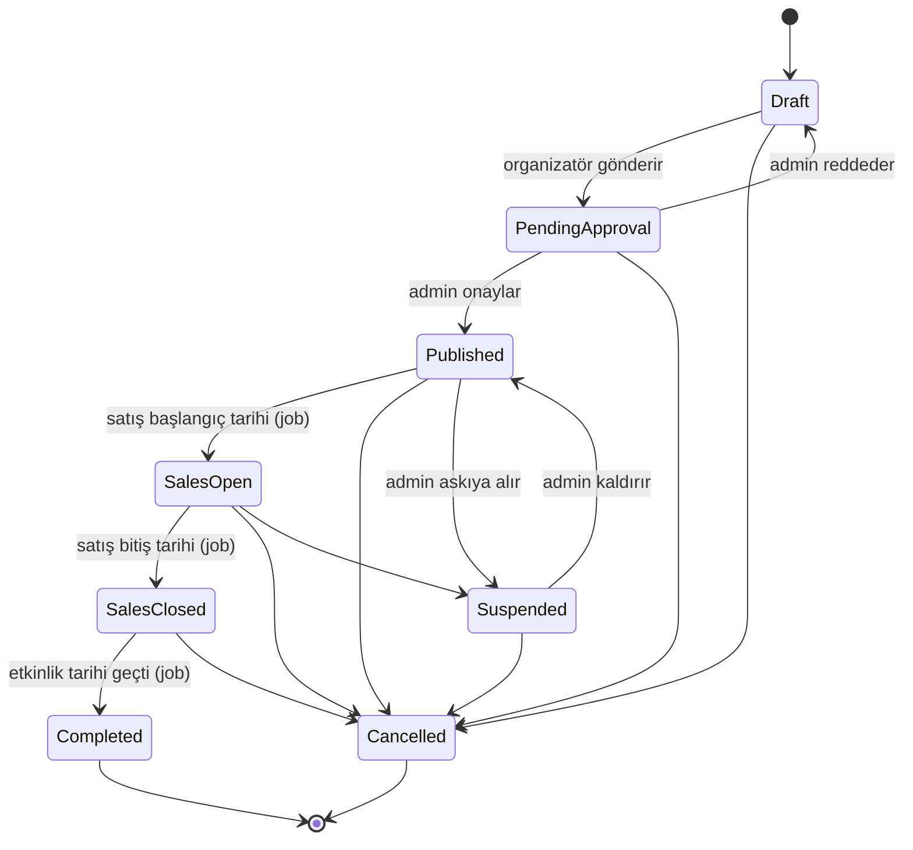
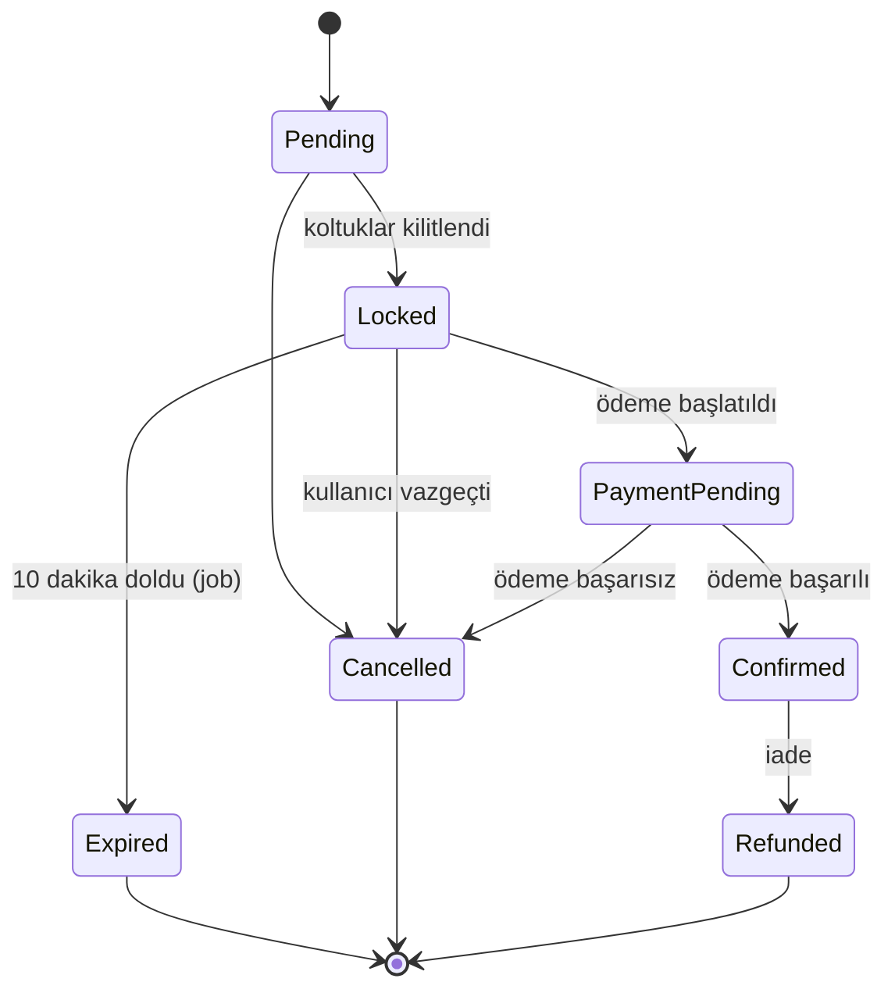
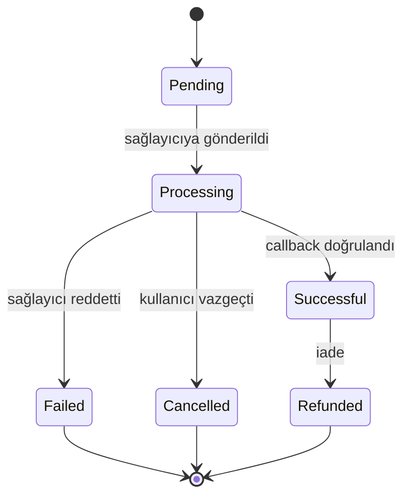
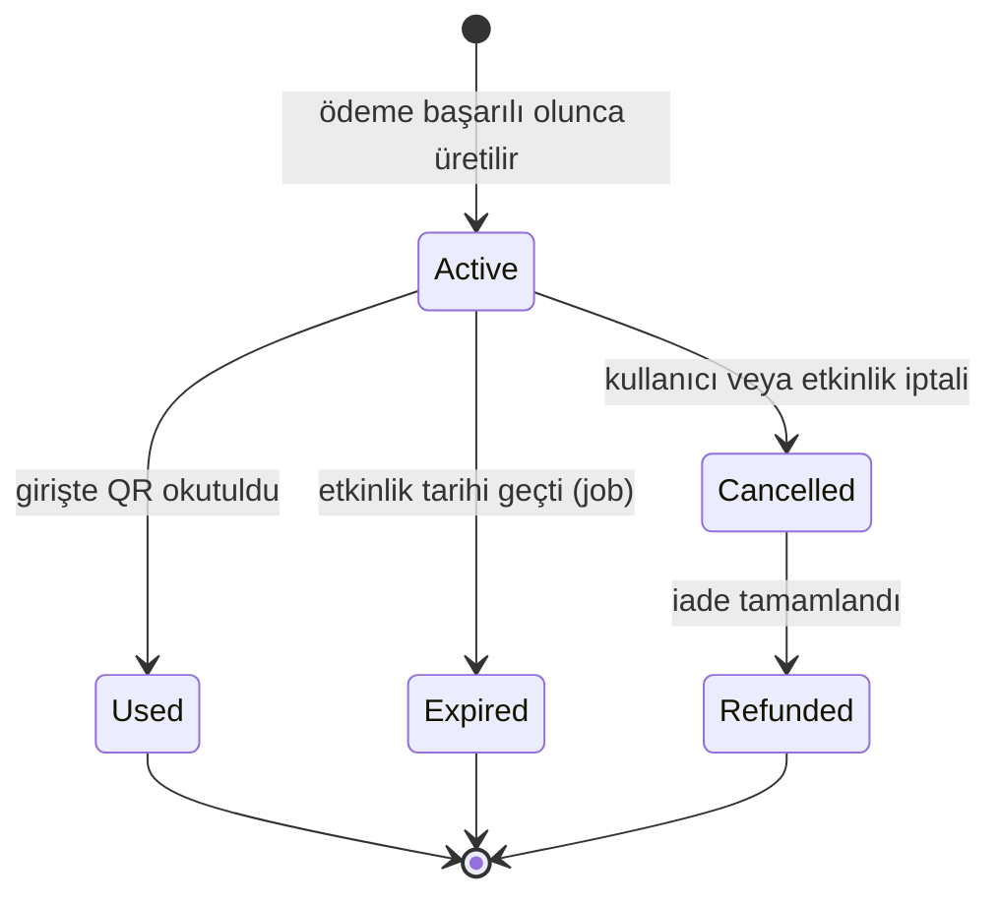

# Durum Makineleri

> Tarih: 24.07.2026 · Gün 1

Dört varlığın yaşam döngüsü. Geçişler domain entity metotlarında kodlanacak; geçersiz bir geçiş denendiğinde `DomainException` fırlatılıp **409 Conflict** dönecek.

## Etkinlik

Yayına alma ön koşulları: en az bir oturum, en az bir bilet türü, poster görseli, geçerli tarih aralığı. Koşullardan biri sağlanmazsa `Publish()` çağrısı hata verir.

`Completed` durumuna gelmeden etkinliğe yorum yapılamaz.

## Rezervasyon

`Expired` ve `Cancelled` durumlarında koltuklar `Available` yapılır.

## Ödeme

Aynı rezervasyon için birden fazla `Successful` ödeme oluşamaz. Bu kural veritabanı seviyesinde kısmi (filtered) unique index ile garantilenir.

## Bilet

Her `ReservationItem` için tam olarak bir bilet üretilir.

## Geçersiz geçişler

Bu liste birim testlerine dönüşecek. Her satır için "geçiş denendiğinde 409 döner" testi yazılacak.

| Geçersiz geçiş | Neden yasak |
|---|---|
| `Expired → PaymentPending` | Süresi dolmuş rezervasyon üzerinden ödeme başlatılamaz |
| `Cancelled → Confirmed` | İptal edilmiş rezervasyon canlandırılamaz |
| `Confirmed → Locked` | Onaylanmış rezervasyon geri kilide dönemez |
| `Refunded → Confirmed` | İade edilmiş ödeme geri alınamaz |
| `Completed → SalesOpen` | Biten etkinlik satışa açılamaz |
| `Cancelled → Published` | İptal edilmiş etkinlik yayınlanamaz |
| `Used → Active` | Kullanılmış bilet tekrar aktifleşemez |
| `Successful → Processing` | Tamamlanmış ödeme işleme dönemez |

Uygulama deseni: izin verilen geçişler entity içinde bir sözlükte tutulur, `TransitionTo()` metodu bu sözlüğe bakar. Kural tek yerde durur, okunabilir ve test edilebilir kalır.
