# Mimari

> Tarih: 28.07.2026 · Gün 3
> Bu dosya projenin yapısal kararlarını sırayla anlatır. Her diyagram bir öncekinin üzerine biner:
> dışarıdan içeriye (topoloji → katman → istek → akış → veri).

## İçindekiler

| # | Diyagram | Ne anlatır |
|:---:|---|---|
| 1 | [Sistem topolojisi](#1-sistem-topolojisi) | Docker'da hangi servis nerede |
| 2 | [Katman mimarisi](#2-katman-mimarisi) | Onion'un dört halkası |
| 3 | [Bağımlılık akışı](#3-bağımlılık-akışı) | Hangi proje kimi referans alır, neyi alamaz |
| 4 | [Solution yapısı](#4-solution-yapısı) | Klasör ağacı |
| 5 | [Bir isteğin yolculuğu](#5-bir-isteğin-yolculuğu) | HTTP'den veritabanına ve geri |
| 6 | [MediatR pipeline](#6-mediatr-pipeline) | Handler'a girmeden önce ne oluyor |
| 7 | [Hata → HTTP eşlemesi](#7-hata--http-eşlemesi) | Hangi hata hangi durum kodu |
| 8 | [Kimlik doğrulama](#8-kimlik-doğrulama) | Refresh token rotation ve yeniden kullanım tespiti |
| 9 | [Yetkilendirme](#9-yetkilendirme) | Üç seviye |
| 10 | [Rezervasyon akışı](#10-rezervasyon-akışı) | Projenin en kritik on adımı |
| 11 | [Katmanlı kilit savunması](#11-katmanlı-kilit-savunması) | Üç savunma hattı |
| 12 | [Outbox ve arka plan işleri](#12-outbox-ve-arka-plan-işleri) | Transaction'dan sonra ne oluyor |

---

## 1. Sistem topolojisi

Yedi servis, tek `docker-compose.yml`. `api` ve `web` `app` profilinde — geliştirme sırasında bu ikisi konteyner yerine yerelde çalıştırılabilsin diye.

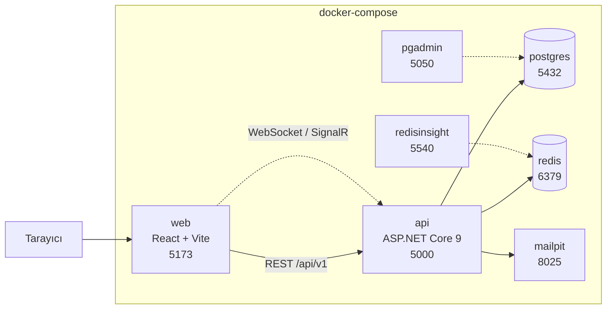

Kesikli oklar geliştirme aracı bağlantılarıdır, uygulama akışının parçası değildir.

`depends_on` tek başına yetmez: "konteyner başladı" ile "servis hazır" aynı şey değil. Her veri servisinde healthcheck var, `api` bunları `condition: service_healthy` ile bekliyor.

---

## 2. Katman mimarisi

Onion Architecture. Kural tek cümlede: **bağımlılık okları hep içeri bakar.**

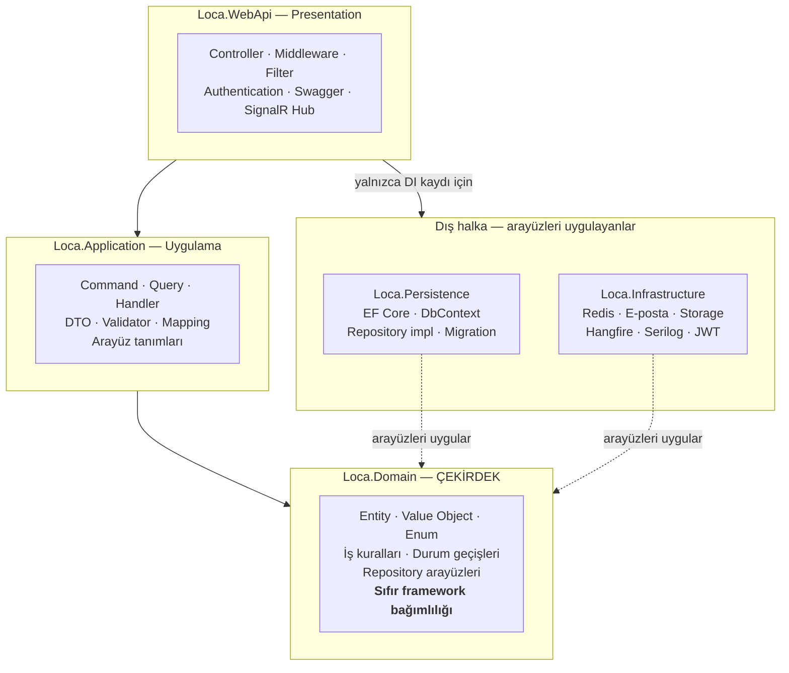

**Bağımlılığın tersine çevrilmesi (dependency inversion)** buranın can alıcı noktası. `Application` katmanı "bana bir token üreteci lazım" der ve `IJwtTokenGenerator` arayüzünü **kendi içinde** tanımlar. Bu arayüzü uygulayan sınıf `Infrastructure`'dadır. Böylece ok `Infrastructure → Application` yönünde akar; `Application` altındakini hiç tanımaz.

`WebApi`'nin `Persistence` ve `Infrastructure`'ı referans almasının tek sebebi `Program.cs`'te DI kayıtlarını yapabilmektir — composition root budur. Controller'lar bu katmanların tiplerini **kullanamaz**; bu kural Gün 2'de yazılan architecture testleriyle bağlanır.

---

## 3. Bağımlılık akışı

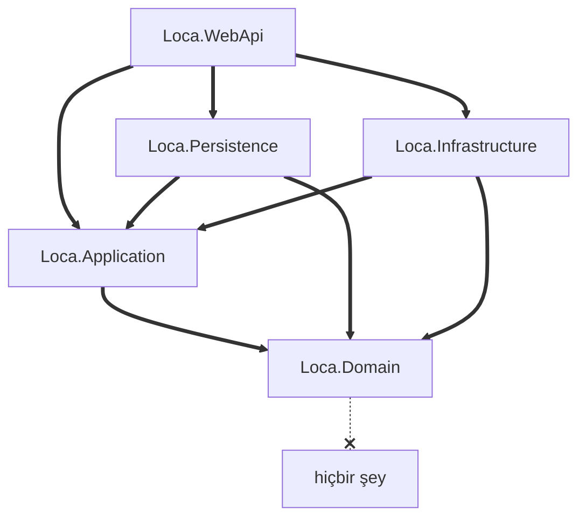

`Domain` hiçbir projeye referans vermez. `Loca.Domain.csproj` içinde tek bir `ProjectReference` veya `PackageReference` satırı yoktur — bu kasıtlıdır ve testle korunur.

### Yasak referanslar

Bunların her biri bir architecture testine karşılık gelir.

| # | Yasak | Neden |
|:---:|---|---|
| 1 | `Domain → Infrastructure / Persistence / WebApi` | Çekirdek altyapıyı tanırsa test edilemez ve teknoloji değişimi imkânsızlaşır |
| 2 | `Application → WebApi` | Uygulama katmanı HTTP'yi bilmemeli; aynı handler bir konsol uygulamasından da çağrılabilmeli |
| 3 | Handler `Loca.Application.Features` dışında | CQRS klasör düzeni tek yerde toplansın |
| 4 | Controller içinde `DbContext` | İş kuralı controller'a sızmasın, sorgular handler'da kalsın |
| 5 | Endpoint'in entity döndürmesi | Veritabanı şeması API sözleşmesi hâline gelmesin |

---

## 4. Solution yapısı

```
Loca.sln
├── Directory.Build.props        net9.0 · Nullable · TreatWarningsAsErrors
├── .editorconfig                kapatılan analyzer kuralları ve gerekçeleri
├── docker-compose.yml           7 servis
├── .env.example                 gerçek .env gitignore'da
│
├── src/
│   ├── Loca.Domain/
│   │   ├── Common/              BaseEntity · ISoftDeletable · IAggregateRoot
│   │   │                        Money · DomainException
│   │   ├── Entities/            28 tablonun karşılığı
│   │   ├── Enums/               durum makineleri
│   │   └── Repositories/        arayüzler
│   │
│   ├── Loca.Application/
│   │   ├── Common/
│   │   │   ├── Models/          Result · Result<T> · Error · PagedResult<T>
│   │   │   ├── Behaviors/       ValidationBehavior · LoggingBehavior
│   │   │   └── Interfaces/      IJwtTokenGenerator · ICurrentUserService ...
│   │   └── Features/            CQRS — özellik başına klasör
│   │       ├── Auth/
│   │       ├── Venues/
│   │       ├── Events/
│   │       └── Reservations/
│   │
│   ├── Loca.Persistence/        LocaDbContext · Configurations · Migrations
│   │                            Interceptors · Repositories
│   ├── Loca.Infrastructure/     Redis · E-posta · Storage · Hangfire · JWT
│   └── Loca.WebApi/             Controllers · Middleware · Hubs · Program.cs
│
├── tests/
│   ├── Loca.UnitTests/          domain kuralları, handler'lar
│   ├── Loca.IntegrationTests/   Testcontainers ile gerçek PostgreSQL + Redis
│   └── Loca.ArchitectureTests/  5 katman kuralı
│
├── docs/                        analiz · veri modeli · tasarım · diyagramlar
└── web/                         React + TypeScript + Vite
```

`Features/` altındaki her klasör bir iş yeteneğidir; teknik tipe göre (`Commands/`, `Queries/`) değil özelliğe göre gruplanır. Bir özelliğe dokunurken tek klasör açılır.

---

## 5. Bir isteğin yolculuğu

Örnek: `GET /api/v1/events/{id}`. Bu akış tüm endpoint'lerde aynıdır.

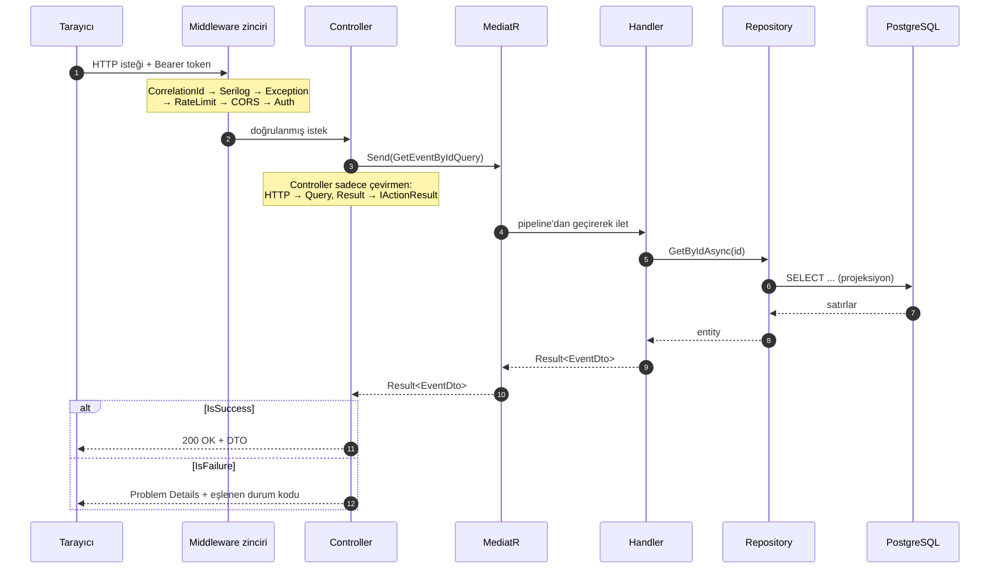

Dikkat edilecek üç nokta:

- **Controller'da `if` ile iş kuralı yok.** Controller isteği bir command/query nesnesine çevirir, `Result`'ı HTTP cevabına çevirir. Arada başka bir şey yapmaz.
- **Entity dışarı çıkmaz.** Handler `EventDto` döner. Bu, architecture testi #5 ile korunur.
- **`Result` kullanılır, exception atılmaz.** "Koltuk dolu" beklenen bir durumdur; exception beklenmeyen durumlar içindir.

---

## 6. MediatR pipeline

Handler'a ulaşmadan önce her istek aynı iki halkadan geçer. Bu sayede doğrulama ve loglama her handler'da tekrar yazılmaz.

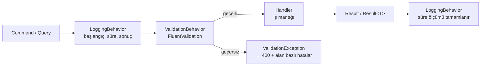

`ValidationBehavior` ilgili `IValidator<TRequest>` kayıtlarını DI'dan toplar, hepsini çalıştırır ve **tüm** hataları tek seferde döner — kullanıcı formu tek tek düzeltmek zorunda kalmasın.

Doğrulama katmanları birbirini tekrar etmez:

| Katman | Neyi doğrular | Örnek |
|---|---|---|
| FluentValidation | Girdinin şekli | E-posta formatı, zorunlu alan, sayı aralığı |
| Domain entity | İş kuralı | `Publish()` için en az bir oturum gerekir |
| Veritabanı | Son savunma | `UNIQUE(EventSessionId, SeatId)` |

---

## 7. Hata → HTTP eşlemesi

Tüm hata cevapları RFC 7807 Problem Details formatındadır. Eşleme tek yerde, `GlobalExceptionMiddleware` içinde durur.

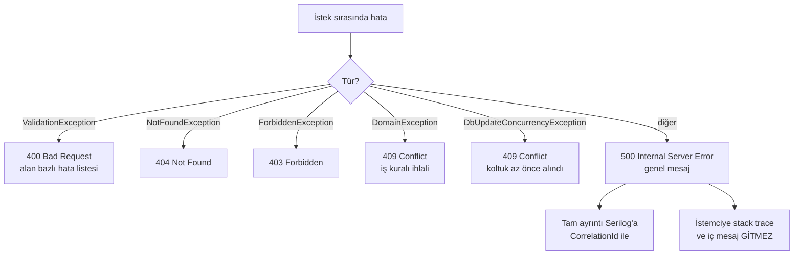

`Result` dönen handler'larda `ErrorType` aynı eşlemeyi kullanır: `Validation → 400`, `NotFound → 404`, `Forbidden → 403`, `Conflict → 409`.

Her cevapta `traceId` ve `instance` alanları bulunur; kullanıcı hata bildirdiğinde log bu kimlikle tek sorguda bulunur.

---

## 8. Kimlik doğrulama

Access token 15 dakika, refresh token 7 gün. Kısa access süresi çalınan token'ın ömrünü sınırlar; refresh token bunu kullanıcıya hissettirmeden telafi eder.

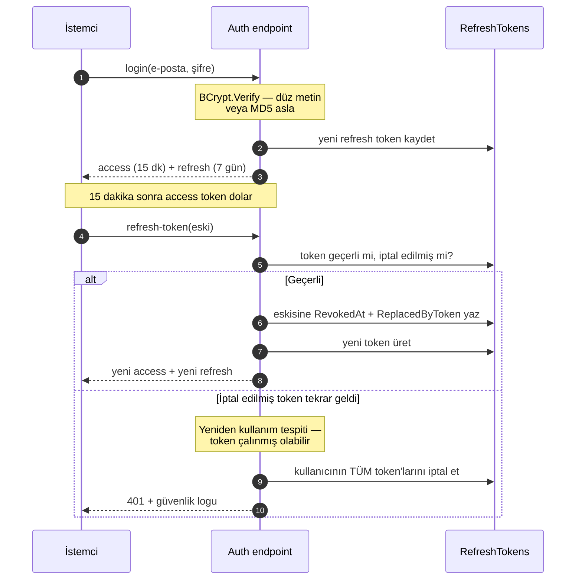

**Rotation** her kullanımda token'ı değiştirir. **Reuse tespiti** ise şunu yakalar: saldırgan token'ı çaldıysa ve kurban ondan önce yenilediyse, saldırganın elindeki artık iptal edilmiş bir token'dır. O token geldiği anda oturumun tamamı kapatılır.

İstemci tarafında bir incelik var: sayfa açılışında altı istek birden 401 alırsa altı ayrı refresh çağrısı gider ve rotation yüzünden beşi başarısız olur. Bu yüzden axios interceptor'ında **tek refresh + kuyruk** mantığı kurulur; ilk 401 refresh'i başlatır, diğerleri sonucu bekler.

---

## 9. Yetkilendirme

Üç seviye, üçü de birbirini tamamlar. Hiçbiri controller içinde `if` ile yazılmaz.

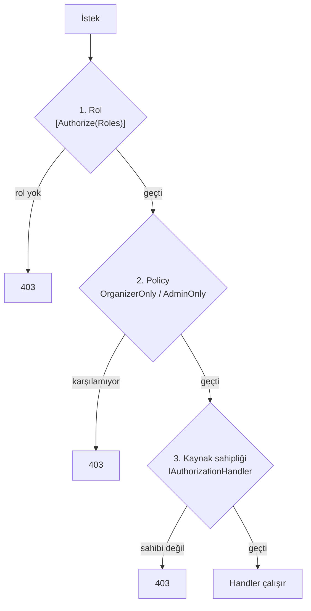

| Seviye | Soru | Uygulama |
|:---:|---|---|
| 1 | Bu kullanıcı hangi rolde? | `[Authorize(Roles = "Admin")]` |
| 2 | Bu iş için gereken koşulları taşıyor mu? | `OrganizerOnly`, `AdminOnly` policy |
| 3 | **Bu kaydın sahibi mi?** | `EventOwner`, `TicketOwner`, `ReservationOwner` handler'ları |

Üçüncü seviye atlanırsa klasik açık ortaya çıkar: organizatör rolündeki A kullanıcısı, B'nin etkinliğini düzenleyebilir. Kabul testi nettir — **A'nın token'ıyla B'nin kaynağına istek 403 dönmeli**, 200 de 404 da değil.

---

## 10. Rezervasyon akışı

Projenin kalbi. Adım sırası **değiştirilemez**; özellikle 5. adım atlanamaz.

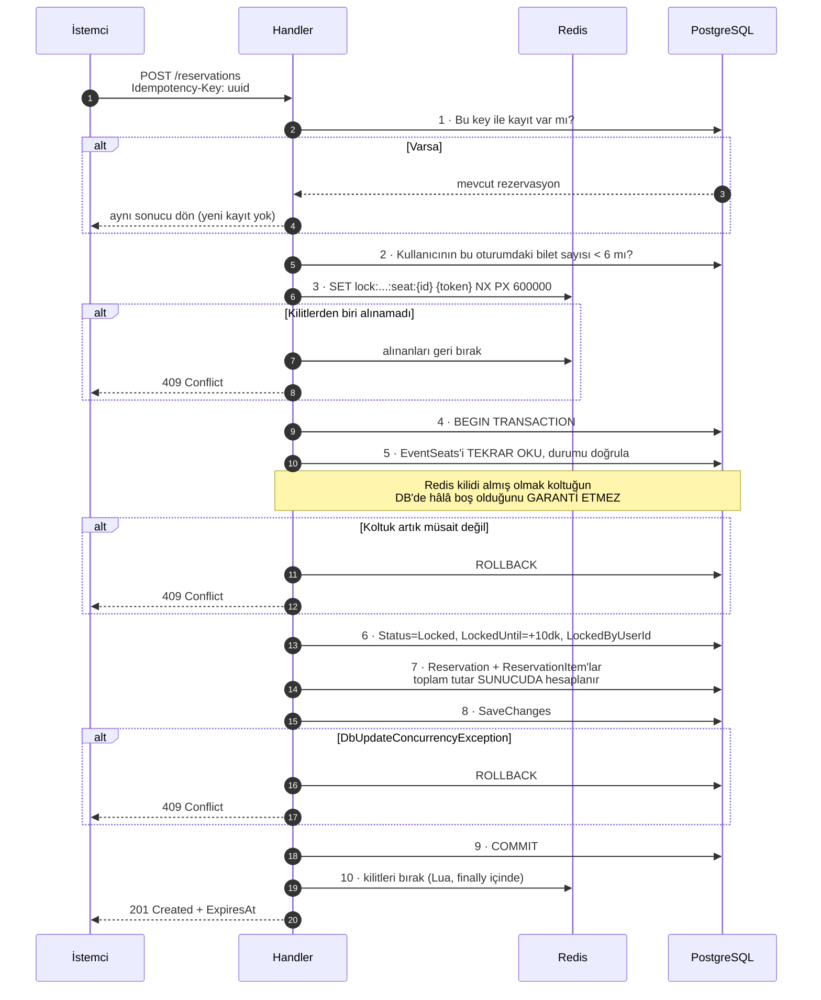

### Neden bu sıra

| Adım | Atlanırsa ne olur |
|:---:|---|
| 1 | Kullanıcı butona iki kez basınca iki rezervasyon oluşur |
| 2 | Bir kullanıcı tüm salonu kilitleyebilir |
| 3 | Her istek doğrudan veritabanına iner, gereksiz yük |
| 4 | Yarım kalmış kayıtlar oluşur |
| **5** | **Aynı koltuk iki kişiye satılır — projedeki en ciddi hata** |
| 7 | İstemci fiyatı manipüle eder |
| 8 | Eşzamanlı güncelleme sessizce üzerine yazar |
| 10 | Koltuklar 10 dakika boyunca kimseye açılmaz |

**Kabul kriteri:** 50 paralel istek aynı koltuğu istediğinde tam olarak **1 başarı, 49 Conflict**. Test 50/50 başarılı çıkıyorsa 5. adım atlanmıştır.

---

## 11. Katmanlı kilit savunması

Dört yöntem değerlendirildi, üçü birlikte kullanılmasına karar verildi. Her katman farklı bir başarısızlık senaryosunu karşılar.

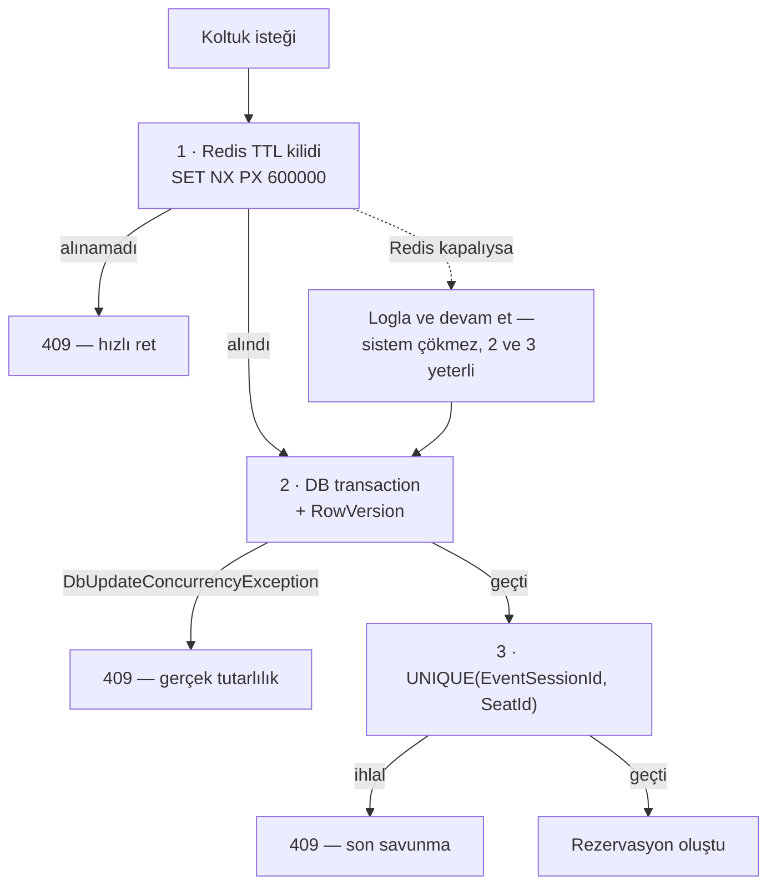

| Katman | Ne için var | Tek başına neden yetmez |
|:---:|---|---|
| Redis TTL kilidi | Hız ve kullanıcı deneyimi | TTL dolduğunda tutarsızlık doğar |
| DB transaction + `RowVersion` | Gerçek tutarlılık | Çakışmada yeniden deneme gerektirir |
| `UNIQUE` constraint | Son savunma hattı | Hatayı yakalayıp anlamlı cevaba çevirmek gerekir |

Kilit bırakma **Lua script** ile yapılır:

```lua
if redis.call("get", KEYS[1]) == ARGV[1] then
  return redis.call("del", KEYS[1])
else
  return 0
end
```

Sebep: `GET` ile `DEL` arasında TTL dolar ve kilidi başka bir istek alırsa, düz `DEL` **başkasının kilidini** siler. Lua script Redis'te atomik çalıştığı için bu aralık kapanır.

Bırakma işlemi `IAsyncDisposable` üzerinden `using` ile yapılır — exception yolunda da çalışsın diye.

---

## 12. Outbox ve arka plan işleri

Ödeme başarılı olduğunda altı iş birden yapılır. Hepsi **tek transaction** içindedir; e-posta gibi dış çağrılar transaction'ın içine alınmaz, `OutboxMessages` tablosuna yazılır.

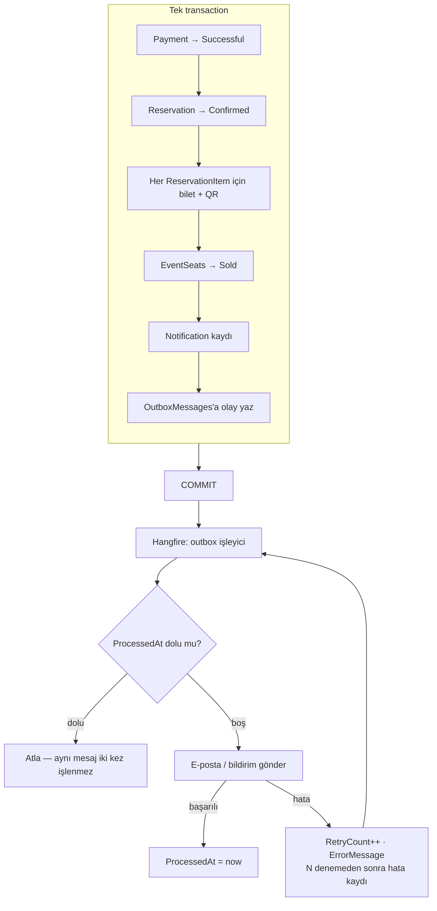

**Neden outbox:** e-posta gönderimi transaction içinde yapılırsa iki kötü senaryo doğar — SMTP yavaşsa transaction uzar ve kilitler birikir; transaction sonradan geri alınırsa e-posta çoktan gitmiştir. Outbox, "veriyi kaydet" ile "yan etkiyi tetikle" adımlarını ayırır ve ikisinin de kaybolmamasını garanti eder.

### Beş job

| # | Job | Sıklık | Ne yapar |
|:---:|---|---|---|
| 1 | Süresi dolan rezervasyonlar | dakikada | `ExpiresAt < now && Status = Locked` → `Expired`, koltuklar `Available` |
| 2 | Outbox işleyici | dakikada | `ProcessedAt` boş mesajları gönderir |
| 3 | Başarısız mesaj tekrarı | saatte | `RetryCount` limitine kadar yeniden dener |
| 4 | Etkinlik hatırlatması | günde | Yaklaşan etkinlik için bildirim üretir |
| 5 | Günlük satış özeti | günde | Organizatöre rapor gönderir |

---

## Kaynaklar

- Veri modeli ve tablo grupları: [`02-veri-modeli.md`](../02-veri-modeli.md)
- Durum makineleri: [`durum-makineleri.md`](./durum-makineleri.md)
- Eşzamanlılık kararının gerekçesi: [`04-eszamanlilik.md`](../04-eszamanlilik.md)
